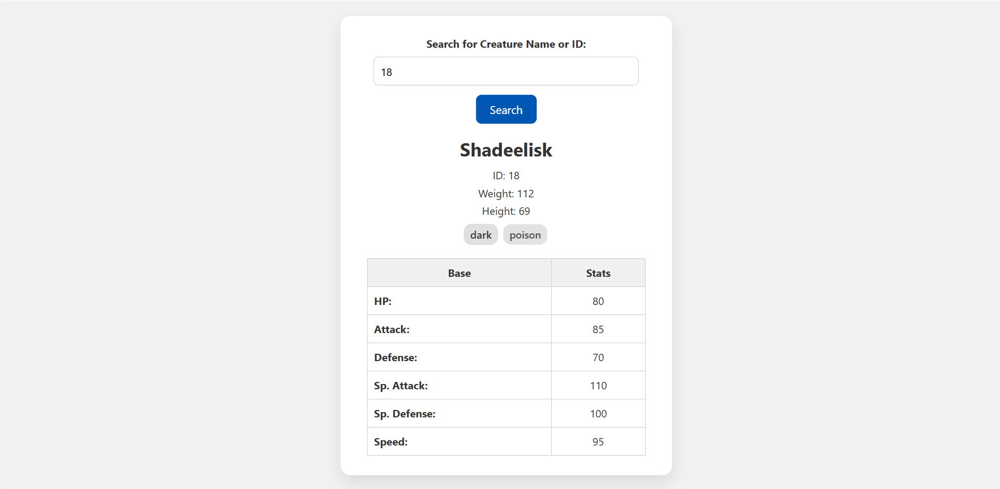
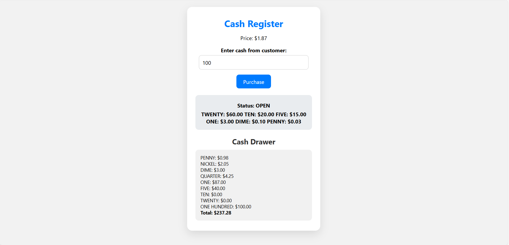
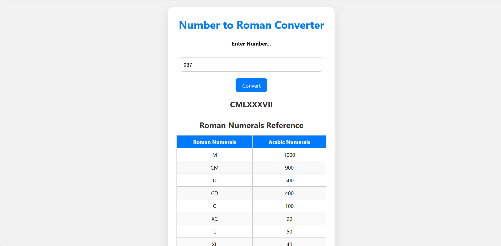
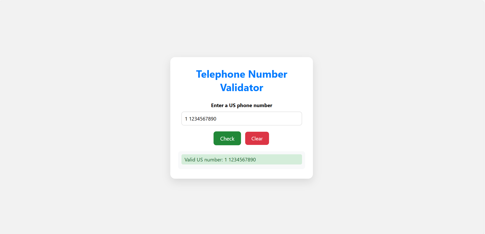
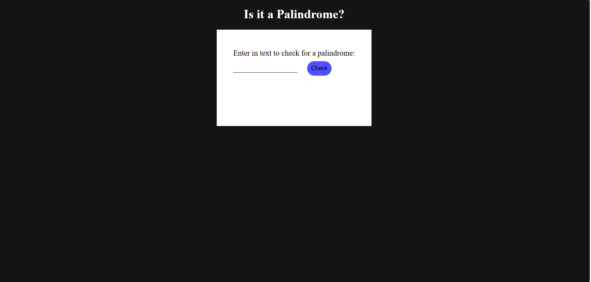

# FreeCodeCamp Projects Collection

This repository contains 5 frontend projects built while learning FreeCodeCamp.  
Each project is self-contained with its own **HTML**, **CSS**, and **JavaScript** files.  
These projects demonstrate practical problem-solving and front-end development skills.

---

## 📂 Projects Overview

### 1. 🐉 RPG Creature Search
Fetches data from an API and displays RPG creature details dynamically.

**Features:**
- Search by name or ID  (ID Range - 1 to 20)
- Displays name, stats, weight, height, and types  
- Loading spinner for better user experience  

🔗 **[Live Demo](https://ayush-awasthi431.github.io/freeCodeCamp-projects/RPGCreatureSearch/)**



---

### 2. 💰 Cash Register
Simulates a working cash register with live change calculation.

**Features:**
- Calculates and returns correct change  
- Updates cash drawer after each purchase  
- Displays register status (OPEN, CLOSED, INSUFFICIENT_FUNDS)  

🔗 **[Live Demo](https://ayush-awasthi431.github.io/freeCodeCamp-projects/CashRegister/)**



---

### 3. 🔢 Number to Roman Converter
Converts numbers (1–3999) into Roman numerals.

**Features:**
- Displays real-time conversion  
- Shows error messages for invalid inputs  
- Includes reference table for Roman numerals  

🔗 **[Live Demo](https://ayush-awasthi431.github.io/freeCodeCamp-projects/RomanConverter/)**



---

### 4. ☎️ Telephone Number Validator
Validates US phone numbers using regex.

**Features:**
- Alerts user if input is empty  
- Displays whether the number is valid or invalid  
- Allows clearing past results  

🔗 **[Live Demo](https://ayush-awasthi431.github.io/freeCodeCamp-projects/TelephoneNumberValidator/)**



---

### 5. 🔄 Palindrome Checker
Checks if a given input string is a palindrome.

**Features:**
- Handles alphanumeric input  
- Ignores case and special characters  
- Gives instant feedback on result  

🔗 **[Live Demo](https://ayush-awasthi431.github.io/freeCodeCamp-projects/PalindromeChecker/)**



---

## 🚀 How to Run Locally

1. Clone this repository:
   ```bash
   git clone https://github.com/Ayush-Awasthi431/freeCodeCamp-projects.git